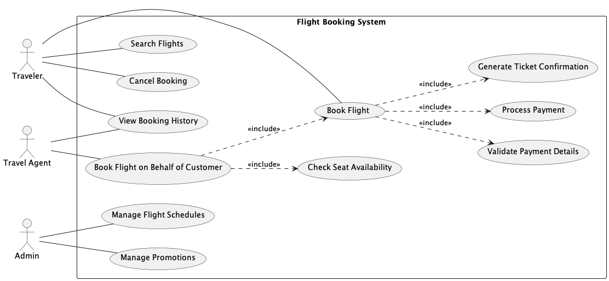
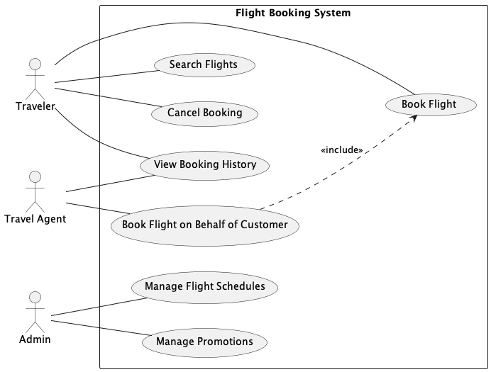
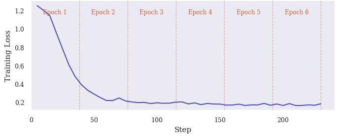
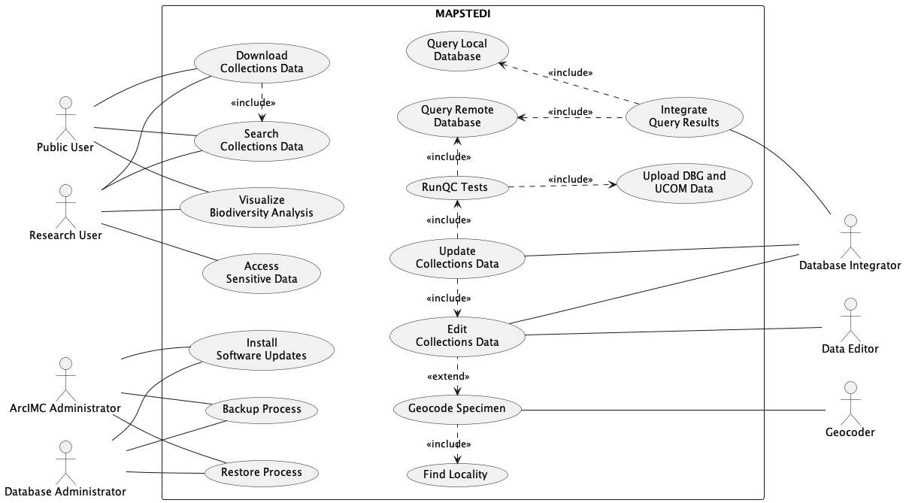

# Introduction {#sec:intro}

Unified Modeling Language (UML) use case diagrams are a primary artifact
in requirements engineering. They describe the functional scope of a
system in terms of actors, use cases, and the relationships between them
(`<<include>>`, `<<extend>>`, and generalisation). Despite their
conceptual simplicity, practitioners regularly introduce structural
antipatterns that reduce diagram clarity, misrepresent system behavior,
or create maintenance obstacles (Lilly 1999; Anda et al. 2001).

One particularly common antipattern is *Functional Decomposition via the
include relationship* (FD-include) (El-Attar and Miller 2006, 2010): a
use case is decomposed into several inclusion use cases that have no
direct association with any actor and provide no observable result of
their own. Detecting such instances requires understanding both the
syntactic structure of the diagram and the semantic intent of the
include relationship, a task that benefits from natural language
reasoning as well as structural analysis.

Existing approaches to antipattern detection in UML rely primarily on
model-checking rules, OCL constraints, or pattern-matching heuristics
(Gogolla et al. 2003; Ballis et al. 2008; Fourati et al. 2011). These
methods are brittle when diagrams do not conform to an expected
representation, and they cannot generalize to novel antipattern types
without expert-authored rules. Recent advances in large language models
(LLMs) offer a promising alternative. Models trained on sufficiently
representative examples can generalize structural reasoning to unseen
diagrams.

However, assembling labeled training data for UML antipatterns is
expensive and scarce in practice. Published datasets of annotated use
case diagrams are small and cover few domains. We address this
bottleneck by using Claude Opus, a state-of-the-art LLM, as a controlled
diagram author to produce a large, diverse, and precisely labeled set of
diagram pairs. This data is then used to fine-tune
Qwen2.5-Coder-3B-Instruct, a compact open-source LLM suitable for
deployment in resource-constrained settings.

This paper presents a prompt-engineering framework that instructs an LLM
to generate syntactically valid, structurally diverse, and correctly
labeled pairs of antipattern and refactored PlantUML diagrams. Using
this framework, we produced a dataset of 388 annotated samples spanning
194 application domains, each diagram containing 1--5 antipattern
instances. Building on this data, we fine-tune a 3B-parameter LLM that
achieves 91.0% detection accuracy on held-out test samples.

The remainder of this paper is structured as follows.
Section [2](#sec:background){reference-type="ref"
reference="sec:background"} reviews relevant background.
Section [3](#sec:pipeline){reference-type="ref"
reference="sec:pipeline"} describes the data generation pipeline.
Section [4](#sec:dataset){reference-type="ref" reference="sec:dataset"}
characterizes the resulting dataset.
Section [5](#sec:finetuning){reference-type="ref"
reference="sec:finetuning"} details the fine-tuning configuration.
Section [6](#sec:evaluation){reference-type="ref"
reference="sec:evaluation"} presents evaluation results.
Section [7](#sec:mapstedi){reference-type="ref"
reference="sec:mapstedi"} applies the model to a real-world case study.
Section [8](#sec:discussion){reference-type="ref"
reference="sec:discussion"} discusses findings and limitations.
Section [9](#sec:related){reference-type="ref" reference="sec:related"}
surveys related work. Section [10](#sec:conclusion){reference-type="ref"
reference="sec:conclusion"} concludes.

# Background {#sec:background}

## UML Use Case Diagrams and Antipatterns

A UML use case diagram represents the functional requirements of a
system as a set of use cases (ellipses) associated with one or more
actors. Three relationship types express dependencies between use cases:
the `<<include>>` relationship indicates that the base use case always
incorporates the behavior of the inclusion use case; `<<extend>>`
represents optional behavior that may be inserted at an extension point;
and generalisation captures inheritance between actors or between use
cases, indicating that one element is a specialized form of another.

Antipatterns in use case models are recurring modeling mistakes that
violate the intended semantics of these elements (El-Attar and Miller
2010). This work focuses on FD-include, where a use case is divided into
several inclusion use cases that are not directly associated with any
actor. Offering no observable result to a user, they represent internal
sub-steps rather than independent services. The correct refactoring
merges these inclusions back into the base use case. Concretely, an
inclusion use case participates in an FD-include instance if and only
if: (i) it is included by exactly one base use case; (ii) it has no
direct actor association; (iii) it neither includes nor extends any
other use case; (iv) it is not extended by any other use case; and (v)
it is not involved in any generalisation.

## LLMs for Diagram Generation and Fine-Tuning

LLMs have demonstrated strong capabilities in generating structured text
conforming to domain-specific syntaxes, including source code,
configuration files, and markup languages. PlantUML is a text-based
diagram description language; its grammar is sufficiently regular that
frontier models can produce syntactically valid diagrams with minimal
additional scaffolding. This has been demonstrated in security modeling
contexts: ChatGPT-5 has been shown to generate misuse case diagrams
directly in PlantUML from textual security requirements (Alzarooni et
al. 2026), and ChatGPT has been evaluated for generating STRIDE data
flow diagrams, with findings covering syntactic correctness, semantic
accuracy, and trust-boundary placement (Alsayegh and El-Attar 2026).

Adapting a pre-trained LLM to a specialised task such as antipattern
detection, without retraining all weights, is achieved through
parameter-efficient fine-tuning (PEFT). Low-Rank Adaptation (LoRA) (Hu
et al. 2022) is a PEFT technique that injects trainable low-rank
matrices into each weight matrix of a frozen pre-trained model. With
rank $r \ll d$, where $d$ is the dimension of the weight matrix, LoRA
reduces the number of trainable parameters by orders of magnitude while
preserving performance comparable to full fine-tuning.

# Data Generation Pipeline {#sec:pipeline}

## Pipeline Overview

The pipeline takes two inputs. The first is an antipattern specification
that names the antipatterns to be instantiated, providing a
natural-language description and a refactoring strategy for each. The
second is a pool of 194 application domains spanning everyday
(e.g. Banking System, Online Store), moderately common (e.g. Tutoring
Marketplace, Crowdfunding Platform), and niche domains (e.g. Irrigation
Control System, Funeral Service Management System), ensuring the model
sees a wide range of domain vocabularies. These inputs drive three
pipeline stages: LLM-driven diagram generation, quality review, and
training sample packaging, as illustrated in
Figure [1](#fig:pipeline){reference-type="ref"
reference="fig:pipeline"}.

<figure id="fig:pipeline" data-latex-placement="h">

<figcaption>High-level data generation pipeline.</figcaption>
</figure>

## Prompt Design {#sec:prompt}

Each diagram is generated using a two-part prompt: a *system prompt*
that governs the entire session and remains constant across all
diagrams, and a *user prompt* issued once per domain. The system prompt
defines how FD-include instances are identified and counted, what counts
as a UML element, the diagram validity rules, the refactoring scope, and
the required response format.

#### FD-include instance definition.

The system prompt instructs Claude to identify FD-include instances
using the five criteria defined in
Section [2](#sec:background){reference-type="ref"
reference="sec:background"}. Each qualifying (base, inclusion) pair
constitutes one instance; a base use case with $N$ qualifying inclusions
contributes $N$ separate instances. Chain inclusions (A includes B, B
includes C) produce two instances, (A, B) and (B, C), since B is
simultaneously an inclusion use case for A and a base use case for C.
All instances that share the same base use case form an *instance
group*; a diagram in which $k$ base use cases are each decomposed into
qualifying inclusions contains $k$ instance groups.
Figure [2](#fig:domain8){reference-type="ref" reference="fig:domain8"}
shows a Flight Booking System example with two instance groups: *Book
Flight* decomposes into three inclusion use cases (*Validate Payment
Details*, *Process Payment*, *Generate Ticket Confirmation*), and *Book
Flight on Behalf of Customer* decomposes into one (*Check Seat
Availability*). All four are FD-include instances and are dropped in the
refactored version. The remaining `<<include>>` from *Book Flight on
Behalf of Customer* to *Book Flight* is retained because *Book Flight*
is directly associated with an actor and provides an observable result.

<figure id="fig:domain8" data-latex-placement="h">
<figure>

<figcaption>Antipattern: two FD-include instance groups.</figcaption>
</figure>
<figure>

<figcaption>Refactored: all four FD-include instances
removed.</figcaption>
</figure>
<figcaption>Flight Booking System: antipattern and refactored
diagrams.</figcaption>
</figure>

#### Element definition.

The system prompt defines a UML *element* as any of four types: actor,
use case, `<<include>>` arrow, or `<<extend>>` arrow. Diagram size is
expressed as a total element count, with the target for each domain
drawn from the size tier range. The two tiers in
Table [1](#tab:size){reference-type="ref" reference="tab:size"} are
deliberately non-contiguous: small diagrams contain at most one instance
group, while medium diagrams are large enough to support up to three.
The gap between the tiers ensures structural distinction is preserved
regardless of minor count deviations, since Claude may add or omit a few
elements to produce a coherent domain model. The ranges therefore serve
as target guidelines rather than strict constraints.

::: {#tab:size}
  **Size**    **Element range**   **Max instance groups**
  ---------- ------------------- -------------------------
  small             9--13                    1
  medium           24--30                    3

  : Diagram size tiers used during generation.
:::

#### Structural validity rules.

Several rules enforce UML correctness. Every diagram must include a
system boundary rectangle enclosing all use cases, with all actors
placed outside it. Every use case in both versions must be associated
with at least one actor; a use case with no actor association is
invalid. Actor-to-use-case associations must be undirected lines, and
`<<extend>>` arrows must point from the extension use case to the base
use case.

#### Refactoring scope.

The system prompt encodes the refactoring strategy supplied in the
antipattern specification. The refactored version must be derived
strictly from the antipattern version, only elements that participate in
FD-include instances may be removed, and no new use cases, actors, or
associations may be introduced. This constraint ensures that the two
versions are comparable and that the refactored version contains no
spurious domain enrichment.

#### Response format.

The system prompt instructs Claude to produce two PlantUML diagram
versions: one with FD-include instances embedded and one with those
instances refactored away. It also requires an *antipattern detection
label*, a JSON-formatted structured output recording whether the
antipattern is present, which elements are involved in each instance,
and a natural-language explanation. The schema is illustrated in
Listing 1; refactored versions carry a fixed negative label
(`"detected": false`, empty `antipatterns` list). Each element is
identified by its display name followed by its PlantUML identifier in
parentheses (e.g. `UC1`), enabling a downstream modeling tool to locate
and refactor the specific use case without ambiguity.

<figure data-latex-placement="h">

<pre class="sourceCode json"><code class="sourceCode json">{
  &quot;detected&quot;: true,
  &quot;antipatterns&quot;: [{
    &quot;antipattern_name&quot;:
      &quot;Functional Decomposition: Using the
      include relationship&quot;,
    &quot;instance_count&quot;: 1,
    &quot;instances&quot;: [{
      &quot;elements&quot;: [
        &quot;Withdraw Cash (UC1)&quot;,
        &quot;Validate Account (UC2)&quot;
      ],
      &quot;explanation&quot;: &quot;&#39;Validate Account&#39; (UC2)
        is included by &#39;Withdraw Cash&#39; (UC1),
        has no direct actor association
        ... making it a functional decomposition.&quot;
    }]
  }]
}</code></pre>

</figure>

The user prompt is issued once per domain and specifies the target
domain and a target element count drawn from the size tier range. The
Claude Opus 4.6 API is called with this prompt; the response yields a
positive sample (the antipattern PlantUML source with its detection
label) and a negative sample (the refactored PlantUML source), which are
then submitted for manual review. Once approved, each sample is
serialized as a conversational training record containing three
messages: a fixed system prompt, a user message carrying the PlantUML
source, and an assistant message containing the antipattern detection
label. Listing [\[lst:sample\]](#lst:sample){reference-type="ref"
reference="lst:sample"} shows a condensed positive sample; the
corresponding negative (refactored) sample is identical in structure but
with `"detected": false` and an empty `"antipatterns"` list.

<figure data-latex-placement="H">

<pre class="sourceCode json"><code class="sourceCode json">{
  &quot;messages&quot;: [
    {
      &quot;role&quot;: &quot;system&quot;,
      &quot;content&quot;: &quot;You are an expert in UML use case
        diagram analysis ...&quot;
    },
    {
      &quot;role&quot;: &quot;user&quot;,
      &quot;content&quot;: &quot;Analyze the following PlantUML use
        case model and detect antipatterns. ...
        @startuml
        ...
        @enduml&quot;
    },
    {
      &quot;role&quot;: &quot;assistant&quot;,
      &quot;content&quot;: &quot;{ detected: true, ... }&quot;
    }
  ]
}</code></pre>

</figure>

## Quality Review {#sec:review}

Each generated pair is manually reviewed. Despite the detailed prompt
constraints, Claude does not always produce fully conformant diagrams;
observed issues include use cases with no actor association, violation
of the system boundary rule, refactored versions that retain FD-include
elements or introduce new use cases absent from the antipattern version,
and extension arrows pointing in the wrong direction. When issues are
found, the reviewer notes them as free-text descriptions of the specific
violations. Those notes are then passed to Claude as part of the user
prompt, asking it to regenerate the pair while correcting the identified
issues. This loop typically resolves violations within one or two
additional attempts.

# Dataset Characteristics {#sec:dataset}

The pipeline produced 194 antipattern/refactored pairs spanning as many
distinct application domains (85 small, 109 medium), yielding 388
training samples in total. One pair per domain ensures the model
generalizes across domain vocabulary rather than memorising
domain-specific patterns. Table [2](#tab:stats){reference-type="ref"
reference="tab:stats"} summarises the structural properties of the
generated diagrams.

::: {#tab:stats}
  **Metric**                      **Antipattern**   **Refactored**
  ------------------------------ ----------------- ----------------
  Samples                               194              194
  Total elements (mean)                15.3              11.4
  Use cases (mean)                     10.2              8.2
  Actors (mean)                         2.9              2.9
  Include relationships (mean)          2.1              0.1
  Instances per sample (mean)          1.96              ---
  Instances per sample (range)         1--5              ---
  Diagrams with size *small*            85                85
  Diagrams with size *medium*           109              109

  : Structural statistics of the generated diagram dataset.
:::

The difference in mean element count between antipattern (15.3) and
refactored (11.4) versions directly reflects the refactoring: removing
FD-include instances eliminates inclusion use cases and their
`<<include>>` arrows, reducing total elements by approximately 4 per
diagram on average. Only 16 of 194 refactored diagrams retain any
`<<include>>` relationships, confirming that the generation pipeline
correctly preserves only legitimate includes (those whose inclusion
target is associated with an actor or is included by multiple use
cases). The antipattern instance distribution (1--5 instances per
diagram) provides the model with varied label complexity, including
cases where multiple base use cases each decompose into multiple
sub-steps.

# Fine-Tuning {#sec:finetuning}

We apply PEFT to Qwen2.5-Coder-3B-Instruct ([Hui et al.]{.nocase} 2024),
a 3B-parameter LLM from the Qwen2.5-Coder series. Its pretraining corpus
includes large quantities of code and structured text, making it
well-suited to PlantUML syntax and structured output formatting.
Low-Rank Adaptation (LoRA) (Hu et al. 2022) adapters are applied to all
attention and feed-forward projection matrices with rank $r = 8$ and
scaling factor $\alpha = 16$, training 0.48% of total parameters.
Samples are formatted using the Qwen2.5 chat template with system, user,
and assistant turns, with a maximum sequence length of 2048 tokens. The
dataset is split into training and test sets using a domain-stratified
80/20 partition, where entire domains (both antipattern and refactored
samples) are assigned to either split, ensuring no domain appears in
both. This yields 155 training domains (310 samples) and 39 test domains
(78 samples). The model is trained for 6 epochs; training loss converged
smoothly from above 1.0 to a final value of 0.18, as shown in
Figure [3](#fig:loss){reference-type="ref" reference="fig:loss"}.

<figure id="fig:loss" data-latex-placement="h">

<figcaption>Training loss over 6 epochs.</figcaption>
</figure>

# Evaluation {#sec:evaluation}

Test samples are evaluated at two levels: detection and instance.
Detection accuracy is the fraction of diagrams for which the model
correctly predicts the `detected` field of the detection label; for
positive predictions, the antipattern name is also verified. The model
correctly predicted the presence or absence of an antipattern in 71 of
78 test diagrams, yielding a detection accuracy of 91.0%, with the
correct antipattern name predicted in all positive cases.

Instance classification compares the predicted instance list against the
detection label and assigns TP, TN, FP, and FN counts as follows. A
negative sample (refactored diagram) predicted as negative contributes
one TN; any instance the model predicts on a negative sample contributes
one FP. For a positive sample, each expected instance that the model
correctly predicts contributes one TP, each missed instance contributes
one FN, and each predicted instance with no match in the expected list
contributes one FP. For example, if a positive sample expects two
instances and the model predicts two but only one matches, the result is
1 TP, 1 FP, and 1 FN. Matching checks that `elements` exactly matches
the expected list and that the `explanation` is semantically correct;
all results were manually verified to resolve ambiguous cases.
Precision, recall, F$_1$, instance classification accuracy, and Matthews
Correlation Coefficient (MCC) are derived from these counts.
Table [4](#tab:metrics){reference-type="ref" reference="tab:metrics"}
reports the results over 126 verified classification outcomes.

:::: minipage
::: {#tab:metrics}
                    **Pred. +**   **Pred. $-$**
  ---------------- ------------- ---------------
  **Actual +**        68 (TP)        10 (FN)
  **Actual $-$**      16 (FP)        32 (TN)

  : Instance-level classification results over 126 outcomes across 78
  test samples.
:::
::::

:::: minipage
::: {#tab:metrics}
  **Metric**    **Value**
  ------------ -----------
  Precision       0.81
  Recall          0.87
  F$_1$           0.84
  Accuracy        0.79
  MCC             0.55

  : Instance-level classification results over 126 outcomes across 78
  test samples.
:::
::::

In antipattern detection, recall is the more critical metric, since a
missed antipattern remains silently in the model whereas a false
positive can be dismissed by the modeller on inspection. The model
achieves a recall of 0.87, recovering the majority of expected
FD-include instances, which is the desirable outcome in this context.
Precision at 0.81 reflects some false-positive tendency, as the model
occasionally flags an FD-include instance where none was intended, but
this is an acceptable trade-off. The MCC of 0.55 confirms a
moderate-to-strong positive correlation between predictions and ground
truth, despite the modest dataset size.

Manual inspection of the 16 FP and 10 FN instances reveals three
recurring FP patterns and two FN patterns. Roughly half of all FPs
involve prediction of an FD-include instance whose inclusion-side use
case is directly associated with an actor in the diagram, violating the
criterion that disqualifies it from FD-include membership. This error is
especially consistent when the overlooked actor is a system entity
rather than a human role. In two unrelated booking domains a payment use
case is simultaneously included by a base use case and directly
associated with a Payment Gateway actor, yet the model flags the
relationship as FD-include in both cases. This actor-association error
persists across both the antipattern and refactored versions of the same
domain in three cases, confirming a systematic gap in the model's
actor-association check rather than a stochastic failure. A second FP
pattern is extend-for-include confusion, where an `<<extend>>`
relationship is misread as an FD-include instance. A third, less
frequent pattern involves structurally unrelated use case pairs: the
model asserts an include link between two use cases that share no
relationship in the diagram, suggesting occasional hallucination of
structural connections. Among FNs, the majority are straightforward
omissions in diagrams where other instances in the same diagram were
correctly identified, pointing to incomplete structural scanning rather
than misclassification of relationship type. One FN involves a chain
FD-include where A includes B and B includes C; the second link (B, C)
is missed even though the first (A, B) is detected, likely because the
intermediate node B plays a dual role as both an inclusion use case and
a base use case.

# Real-World Case Study: MAPSTEDI {#sec:mapstedi}

To assess the model's ability to generalise beyond synthetically
generated diagrams, we apply it to a subsystem of MAPSTEDI, a
distributed biodiversity database system used to merge specimen
collections held by the University of Colorado, the Denver Museum of
Nature and Science, and the Denver Botanic Gardens (MAPSTEDI Project
2006). The UC model was originally prepared by graduate students in the
Ecology and Evolutionary Biology Department at the University of
Colorado and has been used as a benchmark in prior antipattern detection
research (El-Attar and Miller 2006, 2010). The subsystem modelled here
covers database access, database integration, database editing, and
administrative processes, comprising 16 use cases and 7 actors.

<figure id="fig:mapstedi" data-latex-placement="h">

<figcaption>MAPSTEDI subsystem UC diagram used as the real-world
evaluation input.</figcaption>
</figure>

Figure [4](#fig:mapstedi){reference-type="ref" reference="fig:mapstedi"}
shows the UC diagram. The three ground-truth FD-include instances,
established by manual inspection against the antipattern definition,
are: (1) *Integrate Query Results* $\to$ *Query Local Database*, where
*Query Local Database* has no direct actor association and represents an
internal query sub-step; (2) *RunQC Tests* $\to$ *Upload DBG and UCOM
Data*, where *Upload DBG and UCOM Data* has no actor association and is
not reachable independently; and (3) *Geocode Specimen* $\to$ *Find
Locality*, where *Find Locality* similarly has no actor association and
is included by only one use case.

The model produced 5 predicted instances, yielding 1 TP, 4 FP, and 2 FN
(Precision = 0.20, Recall = 0.33). The single correct prediction was
instance (1). The 4 FPs expose three failure modes already observed in
the synthetic test set but compounded by the diagram's higher
complexity: two FPs flag use cases that carry direct actor associations
(*Search Collections Data* associated with Public and Research Users;
*Edit Collections Data* associated with Database Integrator and Data
Editor), repeating the actor-association check failure documented in
Section [6](#sec:evaluation){reference-type="ref"
reference="sec:evaluation"}; one FP flags *Query Remote Database*, which
is included by *two* base use cases and therefore represents legitimate
shared behaviour rather than functional decomposition; and one FP flags
*RunQC Tests* despite it having an outgoing include to *Query Remote
Database*, violating the criterion that a decomposed use case must not
itself include other use cases. The 2 FNs, instances (2) and (3), are
straightforward omissions of structurally unambiguous FD-include cases,
consistent with the incomplete-scanning FN pattern in the synthetic
results.

The degraded performance on MAPSTEDI relative to the synthetic test set
is consistent with the synthetic distribution shift discussed in
Section [8](#sec:discussion){reference-type="ref"
reference="sec:discussion"}: the training diagrams are smaller (median 8
use cases), syntactically uniform, and contain at most one antipattern
type per diagram, whereas MAPSTEDI is a practitioner-authored diagram
with 16 use cases, shared-behaviour patterns, and multi-actor use cases
not represented in the training distribution. The case study therefore
confirms the need for real-world diagram examples in the training set
and motivates the dataset extension directions outlined in
Section [8](#sec:discussion){reference-type="ref"
reference="sec:discussion"}.

# Discussion {#sec:discussion}

The results validate that a frontier LLM can serve as a reliable diagram
labeller, as all generated pairs passed manual review, with violations
corrected through targeted regeneration, and the structural statistics
confirm that refactored versions faithfully remove antipattern elements
without introducing spurious additions (16 out of 194 retain legitimate
includes, consistent with the prompt intent). The model achieves
competitive detection performance with only 3 billion parameters and
$<0.5\%$ of its weights updated, confirming that synthetic data
generation combined with parameter-efficient fine-tuning enables
effective specialisation of a compact LLM at modest computational cost.

The current dataset targets only FD-include; the full antipattern
catalogue (El-Attar and Miller 2006, 2010) covers many further types
(e.g. FD-extend, Accessing an Extension Use Case), and generalisation to
any of these would require repeating the generation and fine-tuning
process, or jointly training on multiple antipatterns simultaneously. A
second concern is synthetic distribution shift, as Claude Opus exhibits
systematic stylistic preferences that may differ from
practitioner-authored diagrams, so performance on real-world inputs
remains to be evaluated. Generation is also capped at 5 antipattern
instance groups per diagram, whereas real-world diagrams may contain
more. The FN pattern of incomplete scanning identified in the error
analysis suggests performance may degrade further as instance count
grows. The model was trained and evaluated exclusively on
PlantUML-formatted diagrams, so its applicability to other use case
diagram notations or modeling tools remains untested. Finally, 78 test
samples across 39 domains yield somewhat unstable metric estimates, and
a larger held-out set would provide more reliable performance bounds.

The most immediate extension is broadening the dataset to cover multiple
antipattern types simultaneously, working towards a unified model
capable of detecting a full antipattern catalogue. Expanding the diagram
size range to include larger diagrams would stress-test the model on
more complex inputs. Evaluating on a hand-crafted benchmark of real
practitioner diagrams would measure how well the model generalizes
beyond synthetically generated examples. A natural progression of the
task is to move from detection to refactoring, where the model not only
identifies antipattern instances but also outputs the corrected diagram.

# Related Work {#sec:related}

A metric-based approach for antipattern detection in UML
designs (Fourati et al. 2011) targets class and sequence diagrams. Their
approach detects five antipatterns including Functional Decomposition by
computing OO quality metrics such as coupling, cohesion, and complexity,
and comparing them against predefined thresholds. While it operates at
the UML design level, the approach requires manually defined thresholds.
Our approach differs by learning detection from examples rather than
from metrics or rules, and targets use case diagrams directly from their
PlantUML source.

The most comprehensive catalogue of use case model antipatterns to
date (El-Attar and Miller 2010) identifies 26 recurring modeling defects
(including FD-include targeted in this work) and codifying them as
machine-checkable heuristics within ARBIUM, a supporting tool. Detection
in ARBIUM is semi-automated via OCL-style queries; however, refactoring
suggestions are made textually and applied by the developer manually.
Our work draws on their antipattern taxonomy and takes the next step by
replacing the rule-based detector with the model, removing the need for
hand-crafted detection rules and enabling detection from plain-text
PlantUML sources without requiring the diagram to be serialised in XMI.

Subsequent work (Khan and El-Attar 2016) extends the ARBIUM line by
automating the refactoring step through model transformations: OCL
queries identify antipattern instances, and ATL transformations then
apply the prescribed structural repairs. While this fully automates the
detect-and-refactor loop for a subset of the catalogued antipatterns,
the approach still relies on expert-authored formal rules and requires
diagrams to be serialised in XMI rather than plain-text sources. Our
approach is complementary: by training an LLM on labeled diagram pairs,
we show that the detection task can be learned from examples alone,
without hand-crafted rules.

Early assessments of ChatGPT's ability to generate UML class diagrams
found syntactic and semantic limitations in models of that era (Cámara
et al. 2023). More recent studies show frontier models performing
markedly better on structured diagram generation tasks (Alzarooni et al.
2026; Alsayegh and El-Attar 2026). Our work builds on this capability
but uses it for labeled pair generation rather than
description-to-diagram translation.

# Conclusion {#sec:conclusion}

We have presented an end-to-end pipeline for fine-tuning an LLM to
detect the Functional Decomposition antipattern in PlantUML use case
diagrams. The pipeline uses Claude Opus as a synthetic diagram author to
generate 388 high-quality labeled training samples across 194
application domains, validated through a structured manual review
workflow. Qwen2.5-Coder-3B-Instruct, fine-tuned with LoRA on this
dataset, achieves 91.0% detection accuracy on a domain-held-out test
set, demonstrating that PEFT on LLM-generated synthetic data is an
effective strategy for specializing compact models on structured UML
reasoning tasks. The pipeline is designed to scale, as additional
antipattern types can be added to the configuration and the generation
process repeated, extending the detector to new antipattern types
without any manual data collection. The dataset, generation scripts,
fine-tuning notebook, and evaluation results are publicly
available (Khan and El-Attar 2026).

:::::::::::::::::: {#refs .references .csl-bib-body .hanging-indent}
::: {#ref-alsayegh2026stride .csl-entry}
Alsayegh, H., and M. El-Attar. 2026. *A Preliminary Exploratory
Assessment of ChatGPT to Generating STRIDE Data Flow Diagrams*. INSTICC;
SciTePress. <https://doi.org/10.5220/0014722800004015>.
:::

::: {#ref-enase26 .csl-entry}
Alzarooni, A., Y. Khan, H. Alsayegh, M. El-Attar, and R. Grati. 2026.
*Evaluating ChatGPT-5 for Misuse Case Diagram Generation: An Empirical
Evaluation*. INSTICC; SciTePress.
<https://doi.org/10.5220/0015014000004015>.
:::

::: {#ref-anda2001quality .csl-entry}
Anda, B., D. I. K. Sjøberg, and M. Jørgensen. 2001. "Quality and
Understandability in Use Case Models." *Proceedings of the 15th European
Conference on Object-Oriented Programming (ECOOP 2001)*, 402--28.
:::

::: {#ref-ballis2008rule .csl-entry}
Ballis, D., A. Baruzzo, and M. Comini. 2008. "A Rule-Based Method to
Match Software Patterns Against UML Models." *Electronic Notes in
Theoretical Computer Science* 219: 51--66.
<https://doi.org/10.1016/j.entcs.2008.10.034>.
:::

::: {#ref-camara2023chatgptuml .csl-entry}
Cámara, J., J. Troya, L. Burgueño, and A. Vallecillo. 2023. "On the
Assessment of Generative AI in Modeling Tasks: An Experience Report with
ChatGPT and UML." *Software and Systems Modeling* 22: 781--93.
<https://doi.org/10.1007/s10270-023-01105-5>.
:::

::: {#ref-elattar2006matching .csl-entry}
El-Attar, M., and J. Miller. 2006. "Matching Antipatterns to Improve the
Quality of Use Case Models." *Proceedings of the 14th IEEE International
Requirements Engineering Conference (RE'06)*.
<https://doi.org/10.1109/RE.2006.36>.
:::

::: {#ref-elattar2010improving .csl-entry}
El-Attar, M., and J. Miller. 2010. "Improving the Quality of Use Case
Models Using Antipatterns." *Software & Systems Modeling* 9 (2):
141--60. <https://doi.org/10.1007/s10270-009-0112-9>.
:::

::: {#ref-fourati2011metric .csl-entry}
Fourati, R., N. Bouassida, and H. B. Abdallah. 2011. "A Metric-Based
Approach for Anti-Pattern Detection in UML Designs." In *Computer and
Information Science 2011*, edited by R. Lee, vol. 364. Springer.
:::

::: {#ref-gogolla2003validation .csl-entry}
Gogolla, M., J. Bohling, and M. Richters. 2003. "Validation of UML and
OCL Models by Automatic Snapshot Generation." *Proceedings of the 6th
International Conference on the Unified Modeling Language (UML 2003)*
(Berlin).
:::

::: {#ref-hu2022lora .csl-entry}
Hu, E. J., Y. Shen, P. Wallis, et al. 2022. "LoRA: Low-Rank Adaptation
of Large Language Models." *Proceedings of the International Conference
on Learning Representations (ICLR)*. <https://arxiv.org/abs/2106.09685>.
:::

::: {#ref-hui2024qwen2 .csl-entry}
[Hui, B., J. Yang, Z. Cui, et al.]{.nocase} 2024. *Qwen2.5-Coder
Technical Report*. <https://arxiv.org/abs/2409.12186>.
:::

::: {#ref-khan2016model .csl-entry}
Khan, Y. A., and M. El-Attar. 2016. "Using Model Transformation to
Refactor Use Case Models Based on Antipatterns." *Information Systems
Frontiers* 18 (1): 171--204.
<https://doi.org/10.1007/s10796-014-9528-z>.
:::

::: {#ref-khan2026repo .csl-entry}
Khan, Y., and M. El-Attar. 2026. *Fine-Tuning an LLM for UML Use Case
Antipattern Detection \[Dataset, Supplementary Materials, and
Results\]*. GitHub.
:::

::: {#ref-lilly1999pitfalls .csl-entry}
Lilly, S. 1999. "Use Case Pitfalls: Top 10 Problems from Real Projects
Using Use Cases." *Proceedings of Technology of Object-Oriented
Languages and Systems (TOOLS 30)*, 174--83.
:::

::: {#ref-mapstedi .csl-entry}
MAPSTEDI Project. 2006. *MAPSTEDI: Mapping Species and Taxa Efficiently
with Distributed Information*.
[Https://mapstedi.sourceforge.net/](https://mapstedi.sourceforge.net/){.uri}.
:::
::::::::::::::::::
